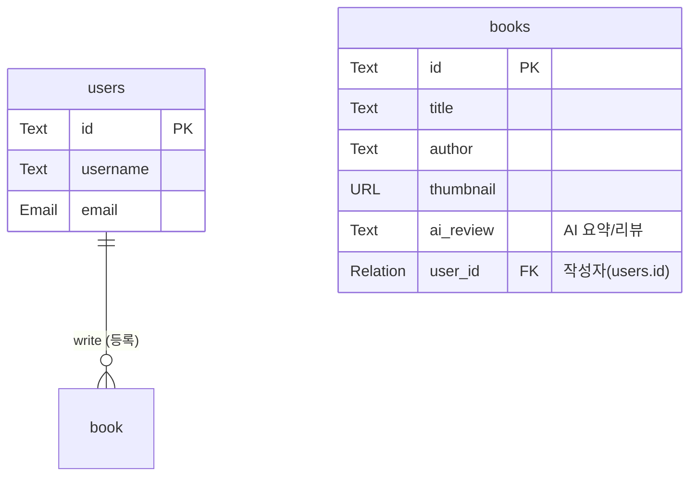

# 데이터베이스 설계서

---

## 테이블

---

### books

실제 클라이언트 `bookProps` 인터페이스와 카카오 API 연동, 그리고 AI 리뷰 기능을 고려하여 설계된 테이블입니다.

| 필드명        | 타입         | 제약조건         | 설명                                                             |
| :------------ | :----------- | :--------------- | :--------------------------------------------------------------- |
| `id`          | Text         | PK (15자)        | 도서 데이터 고유 식별자                                          |
| `title`       | Text         | Required         | 도서 제목                                                        |
| `contents`    | Text         |                  | 도서 본문 및 설명 (카카오 API `contents`와 동일하게 매핑)        |
| `author`      | Text         | Required         | 도서 저자 (프론트엔드에서는 배열을 `, `로 join하여 저장)         |
| `publisher`   | Text         |                  | 출판사                                                           |
| `thumbnail`   | URL / String |                  | 도서 표지 썸네일 (카카오 API 이미지 URL 또는 AI 생성 이미지 URL) |
| `isAvailable` | Bool         | Default: `true`  | 대여 가능 여부                                                   |
| `bestbook`    | Bool         | Default: `false` | 강력 추천(베스트) 도서 여부                                      |
| `ai_review`   | Text         |                  | AI가 작성하거나 요약한 도서 리뷰 데이터                          |
| `user_id`     | Relation     | FK (`users.id`)  | 도서를 등록한 사용자 ID (내 도서 목록 조회를 위함)               |
| `like_count`  | number       | Default: `0`     | 도서 좋아요 수                                                   |
| `created`     | Autodate     | Auto             | 데이터 생성일                                                    |
| `updated`     | Autodate     | Auto             | 데이터 수정일                                                    |

### users

| 필드명            | 타입          | 제약조건         | 설명                                                            |
| :---------------- | :------------ | :--------------- | :-------------------------------------------------------------- |
| `id`              | Text          | PK (15자)        | 사용자 고유 식별자                                              |
| `email`           | Email         | Unique, Required | 사용자 이메일 (로그인 식별자로 사용)                            |
| `password`        | Text          |                  | 사용자 로그인 비밀번호                                          |
| `emailVisibility` | Bool          |                  | 이메일 공개 여부                                                |
| `verified`        | Bool          |                  | 이메일 인증 완료 여부                                           |
| `name`            | Text          |                  | 사용자 이름                                                     |
| `avatar`          | File          |                  | 사용자 프로필 이미지                                            |
| `borrowed_books`  | Relation/List | FK (`books.id`)  | 대여한 도서 목록 (프론트엔드에서는 배열을 `, `로 join하여 저장) |
| `created`         | Autodate      | Auto             | 계정 생성일                                                     |
| `updated`         | Autodate      | Auto             | 계정 정보 수정일                                                |

### likes

| 필드명    | 타입 | 제약조건  | 설명      |
| :-------- | :--- | :-------- | :-------- |
| `book_id` | Text | PK (15자) | 도서 ID   |
| `user_id` | Text | PK (15자) | 사용자 ID |

---

## 릴레이션

### write

사용자(`users`)는 여러 권의 도서(`book`)를 등록할 수 있으며, 하나의 도서는 한 명의 사용자에 의해 등록되는 **1:N (일대다) 관계**입니다.

