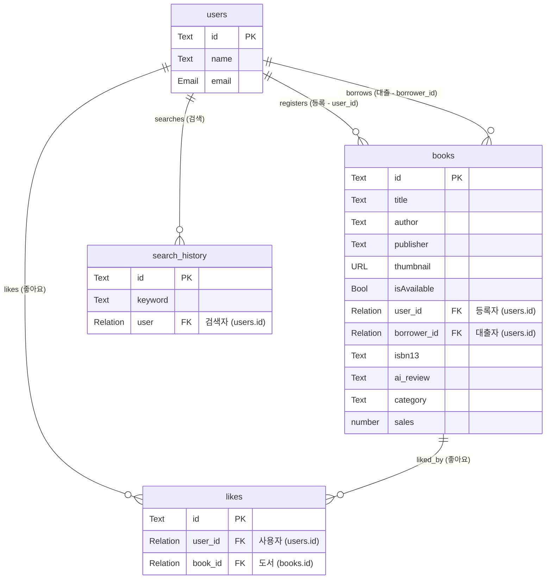

# 데이터베이스 설계서

---

## 테이블

---

### books

실제 클라이언트 `bookProps` 인터페이스와 알라딘 API 연동, 그리고 AI 리뷰 및 대출 검증 기능을 고려하여 설계된 테이블입니다.

| 필드명        | 타입         | 제약조건         | 설명                                                             |
| :------------ | :----------- | :--------------- | :--------------------------------------------------------------- |
| `id`          | Text         | PK (15자)        | 도서 데이터 고유 식별자                                          |
| `title`       | Text         | Required         | 도서 제목                                                        |
| `contents`    | Text         |                  | 도서 본문 및 설명 (알라딘 API `description`과 동일하게 매핑)        |
| `author`      | Text         | Required         | 도서 저자 (프론트엔드에서는 배열을 `, `로 join하여 저장)         |
| `publisher`   | Text         |                  | 출판사                                                           |
| `thumbnail`   | URL / String |                  | 도서 표지 썸네일 (알라딘 API 이미지 URL 또는 AI 생성 이미지 URL) |
| `isAvailable` | Bool         | Default: `true`  | 대여 가능 여부                                                   |
| `borrower_id` | Relation     | FK (`users.id`)  | 현재 이 도서를 대출한 사용자의 ID (대출 중일 때만 바인딩, 반납 시 null) |
| `bestbook`    | Bool         | Default: `false` | 강력 추천(베스트) 도서 여부 (평점 8.5↑ 또는 판매지수 15000↑ 자동판별) |
| `user_id`     | Relation     | FK (`users.id`)  | 도서를 등록한 사용자 ID (마이페이지에서 내 등록 목록 필터링용)    |
| `like_count`  | number       | Default: `0`     | 도서 좋아요 수                                                   |
| `ai_review`   | Text         |                  | AI 요약 및 큐레이션 리뷰 글 (Upstage Solar-pro3 API 스트리밍 저장) |
| `isbn13`      | Text         | Unique, Required | 도서의 13자리 ISBN 고유 키값 (중복 등록 검사용)                   |
| `category`    | Text         |                  | 도서 카테고리 정보 (알라딘 상세 조회 데이터 매핑)                 |
| `sales`       | number       |                  | 도서 판매 지수 (알라딘 상세 조회 데이터 매핑)                     |
| `created`     | Autodate     | Auto             | 데이터 생성일                                                    |
| `updated`     | Autodate     | Auto             | 데이터 수정일                                                    |

---

### users

| 필드명            | 타입          | 제약조건         | 설명                                                            |
| :---------------- | :------------ | :--------------- | :-------------------------------------------------------------- |
| `id`              | Text          | PK (15자)        | 사용자 고유 식별자                                              |
| `email`           | Email         | Unique, Required | 사용자 이메일 (로그인 식별자로 사용)                            |
| `password`        | Text          |                  | 사용자 로그인 비밀번호                                          |
| `emailVisibility` | Bool          |                  | 이메일 공개 여부                                                |
| `verified`        | Bool          |                  | 이메일 인증 완료 여부                                           |
| `name`            | Text          |                  | 사용자 이름                                                     |
| `avatar`          | File          |                  | 사용자 프로필 이미지                                            |
| `created`         | Autodate      | Auto             | 계정 생성일                                                     |
| `updated`         | Autodate      | Auto             | 계정 정보 수정일                                                |

---

### likes

도서와 사용자 간의 "좋아요" N:M 관계를 나타내는 매핑 테이블입니다.

| 필드명    | 타입 | 제약조건  | 설명      |
| :-------- | :--- | :-------- | :-------- |
| `id`      | Text | PK (15자) | 매핑 식별자 |
| `book_id` | Text | FK (`books.id`) | 좋아요가 눌린 도서 ID |
| `user_id` | Text | FK (`users.id`) | 좋아요를 누른 사용자 ID |

---

### search_history

사용자의 최근 도서 검색어 기록을 저장하는 테이블입니다.

| 필드명    | 타입     | 제약조건        | 설명                 |
| :-------- | :------- | :-------------- | :------------------- |
| `id`      | Text     | PK (15자)       | 검색 기록 식별자     |
| `user`    | Relation | FK (`users.id`) | 검색한 사용자 ID     |
| `keyword` | Text     | Required        | 사용자가 입력한 검색어 |
| `created` | Autodate | Auto            | 검색 일시            |

---

## 릴레이션

### 데이터 관계도 (ER Diagram)

- **도서 등록 관계 (1:N)**: 사용자(`users`)는 여러 권의 도서(`books`)를 시스템에 등록할 수 있습니다.
- **도서 대출 관계 (1:N)**: 사용자(`users`)는 여러 권의 도서(`books`)를 대출할 수 있으며, 각 도서는 특정 순간에 한 명의 대출자(`borrower_id`)만을 가집니다.
- **검색 기록 관계 (1:N)**: 사용자는 여러 번의 검색어 기록(`search_history`)을 가질 수 있습니다.
- **좋아요 관계 (N:M)**: 사용자와 도서는 `likes` 매핑 컬렉션을 통해 다대다(N:M) 관계를 맺습니다.

