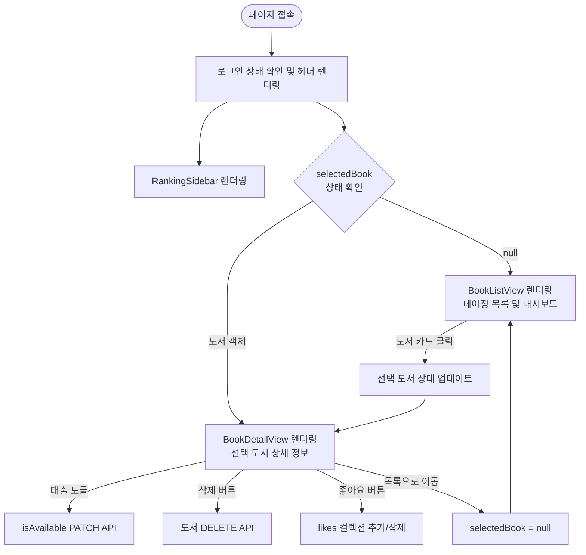
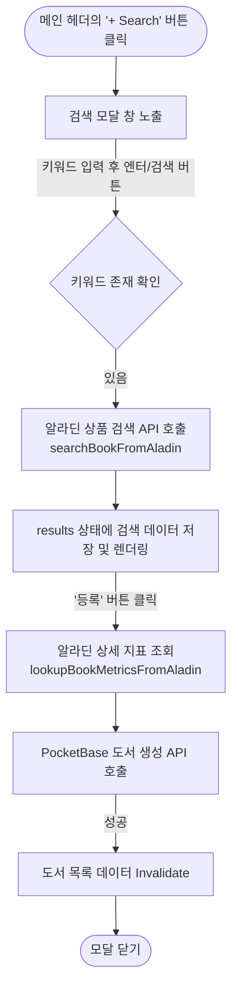
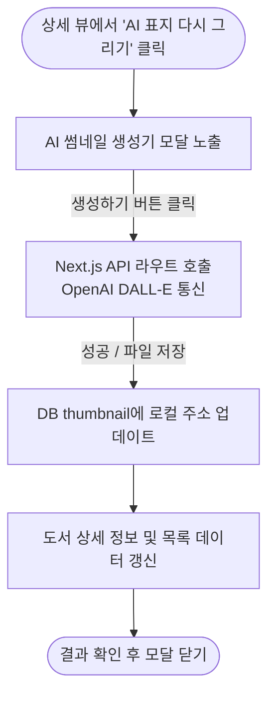

# 화면 정의서 (Wireframe)

본 문서는 도서 대출 관리 애플리케이션의 화면 구조와 데이터 흐름을 정의합니다. 본 사양은 실제 React/Next.js 코드를 기반으로 작성되었습니다.

---

## 1. 메인 페이지 (Screen 1: Main Page)

애플리케이션의 뼈대가 되는 기본 뷰로, 좌측에는 사이드바, 우측/중앙에는 동적으로 변경되는 뷰 컴포넌트를 렌더링합니다.

### 1.1 주요 UI 구성 요소

- **헤더 영역**: 
  - 좌측: 메인 로고 및 타이틀
  - 우측: 로그인 상태에 따른 동적 버튼 (비로그인: [회원가입] [로그인] | 로그인: [사용자 이름] [마이페이지] [로그아웃]) 및 **[+ Search]**, **[+ Creator]** 버튼
- **좌측 플로팅 영역**: `RankingSidebar` 컴포넌트가 위치하며 '인기 도서 TOP 10'을 상시 노출
- **중앙 메인 영역**: `selectedBook` 상태에 따라 아래 두 가지 뷰 중 하나를 교체 렌더링
  - **도서 목록 뷰 (BookListView)**: 전체 도서 8개 단위 페이징 그리드, 정렬 옵션, 상단 대시보드 차트 포함
  - **도서 상세 뷰 (BookDetailView)**: 선택된 단일 도서의 썸네일, 저자, 본문 등 상세 정보와 각종 상호작용 액션 버튼 포함

### 1.2 화면 흐름도 (Flowchart)

---

## 2. 도서 검색 및 등록 모달 (Screen 2: Book Registration Modals)

도서 등록을 위한 두 가지 모달 뷰입니다.
- **Search 모달**: 알라딘 API를 호출하여 도서를 검색 및 등록
- **Creator 모달**: 수동으로 도서 정보를 기입하여 등록

### 2.1 검색 모달 화면 흐름도 (Search Flow)

---

## 3. 인증 관련 모달 및 페이지 (Screen 3: Auth)

### 3.1 로그인 / 회원가입 모달

- 메인 화면 헤더에서 접근 가능한 모달창.
- 이메일과 비밀번호(회원가입 시 이름 추가)를 입력받아 PocketBase Auth API 호출.
- 성공 시 쿠키에 인증 정보 동기화 후 모달을 닫고 UI 갱신.

### 3.2 마이페이지 (`/me`)

- 로그인한 사용자만 접근 가능한 별도 라우트.
- 상단에 사용자 프로필 정보 및 기본 통계 노출.
- 하단에 해당 사용자가 등록한(`user_id`) 도서 목록만 필터링하여 페이징 그리드 노출.

---

## 4. AI 표지 이미지 생성 모달 (Screen 4: AI Generator)

도서 상세 뷰에서 AI로 표지 이미지를 재설정하는 인터페이스입니다.

### 4.1 화면 흐름도 (Flowchart)

