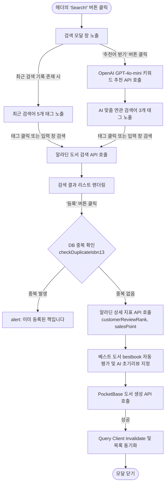
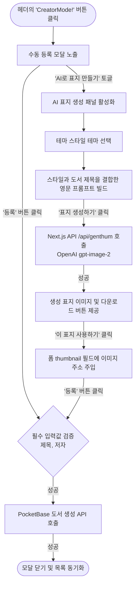
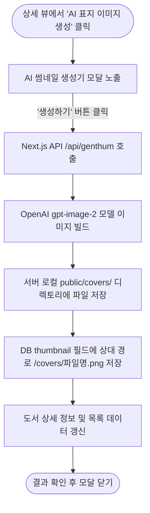
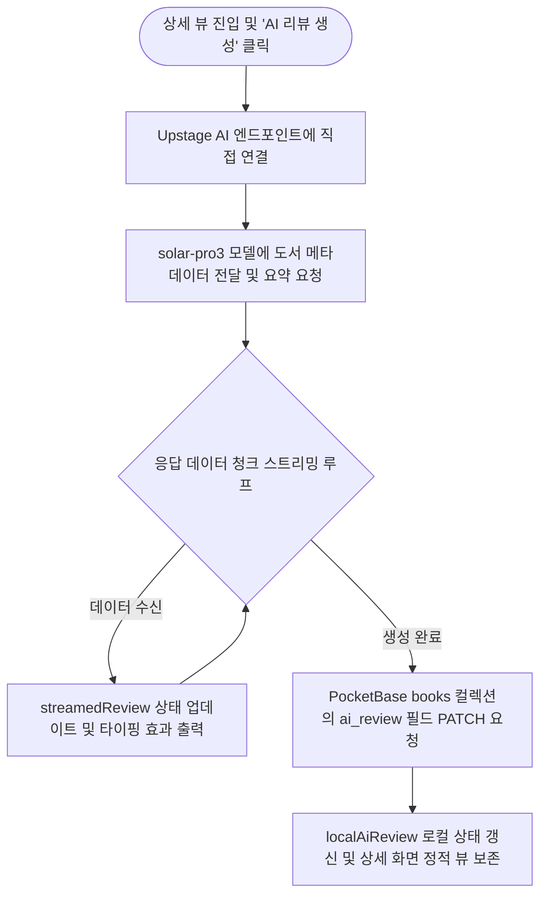

# 화면 정의서 (Wireframe)

본 문서는 도서 대출 관리 애플리케이션의 화면 구조와 데이터 흐름을 정의합니다. 본 사양은 실제 React/Next.js 코드를 기반으로 작성되었습니다.

---

## 1. 메인 페이지 (Screen 1: Main Page)

애플리케이션의 뼈대가 되는 기본 뷰로, 좌측에는 사이드바, 우측/중앙에는 동적으로 변경되는 뷰 컴포넌트를 렌더링합니다.

### 1.1 주요 UI 구성 요소

- **헤더 영역**: 
  - 좌측: 메인 로고 및 타이틀 ("📚 5조의 도서관")
  - 우측: 로그인 상태에 따른 동적 버튼 (비로그인: `[회원가입]` `[로그인]` | 로그인: `[사용자 이름]` `[마이페이지]` `[로그아웃]`) 및 **`[Search!]`**, **`[CreatorMode!]`** 버튼 제공.
- **좌측 플로팅 영역**: `RankingSidebar` 컴포넌트가 위치하며 실시간 '인기 도서 TOP 10'을 상시 노출 (좋아요 순).
- **중앙 메인 영역**: `selectedBook` 상태에 따라 아래 두 가지 뷰 중 하나를 교체 렌더링.
  - **도서 목록 뷰 (BookListView)**: 전체 도서 8개 단위 페이징 그리드, 정렬 드롭다운, 상단 대시보드 대출 현황 차트 포함.
  - **도서 상세 뷰 (BookDetailView)**: 선택된 단일 도서의 썸네일, 저자, 본문 등 상세 정보와 각종 상호작용 액션 버튼 포함.

### 1.2 화면 흐름도 (Flowchart)

---

## 2. 도서 검색 및 등록 모달 (Screen 2: Book Registration Modals)

도서 등록을 위한 두 가지 독립적인 모달 뷰입니다.

### 2.1 검색 및 AI 연관 추천 모달 (Search Modal)

알라딘 API를 활용한 도서 검색 및 최근 검색 이력을 기반으로 한 GPT-4o-mini 연관 키워드 추천 인터페이스를 포함합니다.

#### 화면 흐름도 (Search & AI Recommendation Flow)

### 2.2 수동 등록 및 인라인 AI 표지 메이커 (Creator Modal)

도서의 제목, 저자 등 메타데이터를 직접 기재하는 모달이며, 내장된 인라인 표지 메이커를 제공합니다.

#### 화면 흐름도 (Manual Creator & Inline AI Cover Flow)

---

## 3. 인증 관련 모달 및 페이지 (Screen 3: Auth)

### 3.1 로그인 / 회원가입 모달
- 메인 화면 헤더에서 접근 가능한 모달창.
- 이메일과 비밀번호(회원가입 시 이름 추가)를 입력받아 PocketBase Auth API 호출.
- 성공 시 브라우저 쿠키에 세션 정보를 동기화하고 헤더 UI를 갱신합니다.

### 3.2 마이페이지 (`/me`)
- 로그인한 사용자만 접근 가능한 별도 라우트.
- 상단에 가입자 프로필 정보(이름, 이메일) 및 기본 가입 현황 노출.
- 하단에 해당 사용자가 직접 등록한 도서 목록(`user_id = currentUser.id`)만 필터링하여 페이징 그리드로 노출합니다.

---

## 4. AI 표지 이미지 생성 모달 (Screen 4: Detail View AI Cover Generator)

도서 상세 뷰에서 기존 표지가 없을 경우, 단독 팝업 형태로 실행되는 AI 표지 제작 모달입니다.

### 4.1 화면 흐름도 (Flowchart)

---

## 5. AI 리뷰 및 요약 스트리밍 (Screen 5: AI Review Streaming)

도서 상세 뷰 내에 인라인으로 결합된 AI 도서 요약/리뷰 스트리밍 인터페이스입니다.

### 5.1 화면 흐름도 (Flowchart)

