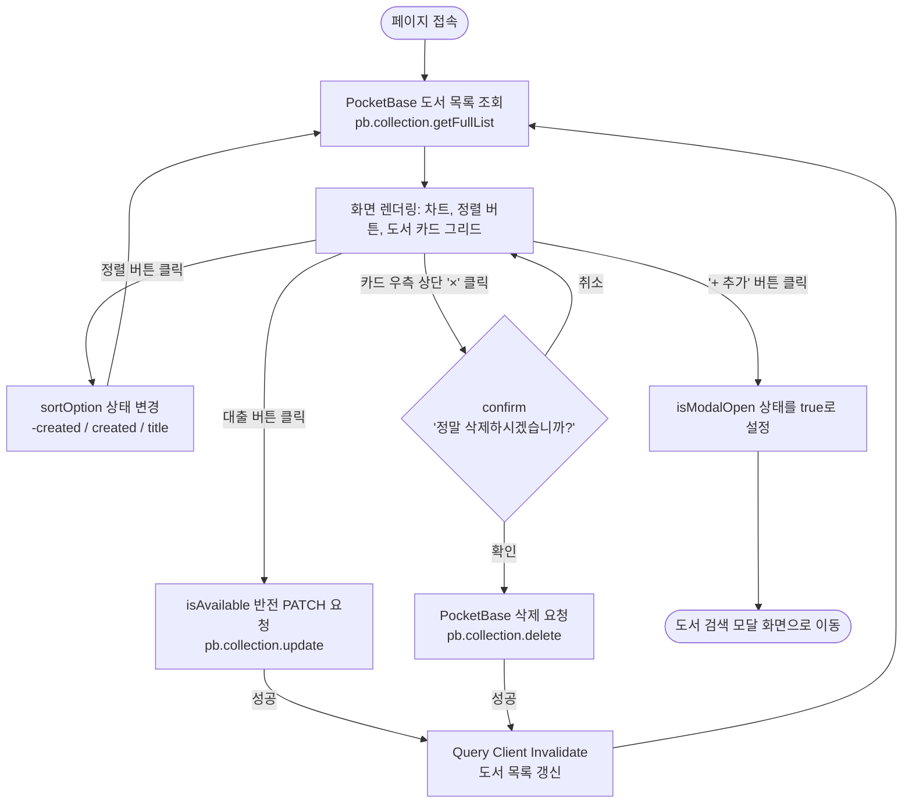
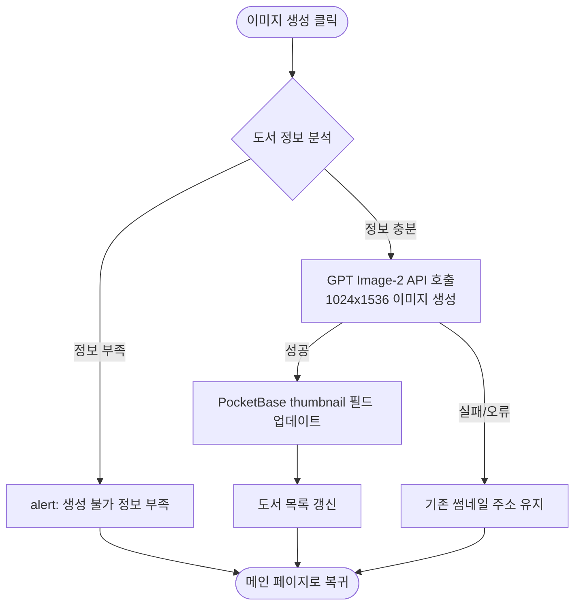

# 화면 정의서 (Wireframe)

본 문서는 도서 대출 관리 애플리케이션의 화면 구조와 각 화면에서의 사용자 상호작용 및 데이터 흐름을 정의합니다. 본 사양은 실제 React/Next.js 코드(`app/page.tsx`, `app/components/AddBookModal.tsx`)의 상태 관리와 API 호출 논리를 기반으로 작성되었습니다.

---

## 1. 메인 페이지 (Screen 1: Main Page)

메인 페이지는 책장의 도서 목록을 그리드 형태로 시각화하고 대출 현황 차트 및 정렬 기능을 제공하는 기본 뷰입니다. Single Page 구조 내에서 동작합니다.

### 1.1 주요 UI 구성 요소
- **헤더 영역**: 타이틀("📚 오승헌의 직박구리🔞"), 서브타이틀, 그리고 도서 등록 모달을 여는 **[+ 추가]** 버튼
- **대시보드 차트**: 전체 도서 수 대비 대출 현황을 보여주는 파이 차트 (`DashboardChart`)
- **정렬 버튼**: 최신순, 오래된 순, 제목순 기준 변경 버튼
- **도서 카드 그리드**: 각 도서의 썸네일, 강추 표시(별표), 제목, 저자/출판사, 대출 상태 토글 버튼, 삭제 버튼(Card 우측 상단 `×`)

### 1.2 화면 흐름도 (Flowchart)



---

## 2. 도서 검색 모달 (Screen 2: Book Search Modal)

도서 등록을 위해 카카오 책 검색 API를 호출하고 결과를 확인하여 PocketBase에 등록하는 오버레이 모달 창입니다.

### 2.1 주요 UI 구성 요소
- **모달 헤더**: 타이틀("도서 검색 및 등록") 및 우측 상단 닫기 **[X]** 버튼
- **검색 창**: 키워드 입력 필드 (`input`), 검색 아이콘 버튼 (`Search`)
- **결과 목록 영역**: 검색된 도서들의 표지(썸네일), 제목, 저자 정보 및 우측 **[등록]** 버튼

### 2.2 화면 흐름도 (Flowchart)

```mermaid
flowchart TD
    START([모달 활성화: isModalOpen=true]) --> RENDER[검색 모달 창 노출]

    %% 닫기 흐름
    RENDER -->|'X' 버튼 클릭| CLOSE[onClose 호출<br/>모달 비활성화]
    CLOSE --> EXIT([메인 페이지 뷰로 복귀])

    %% 검색 흐름
    RENDER -->|키워드 입력 후 Enter 또는 검색 버튼 클릭| SEARCH_CHECK{검색어 존재 여부}
    SEARCH_CHECK -->|비어 있음| ALERT[alert: '검색어를 입력하세요!']
    ALERT --> RENDER
    
    SEARCH_CHECK -->|입력 완료| API_CALL[카카오 책 검색 API 호출<br/>searchBookFromKakao]
    API_CALL --> SET_RESULTS[results 상태에 검색 데이터 저장]
    SET_RESULTS --> RENDER_RESULTS{검색 결과 렌더링<br/>results.map}

    %% 빈 배열 상태
    RENDER_RESULTS -->|결과 없음: 빈 배열 []| EMPTY_VIEW[결과 영역에 아무것도 노출하지 않음<br/>*경고창이나 안내문 없이 코드대로 빈 화면 유지]
    EMPTY_VIEW --> RENDER

    %% 결과 목록에서 등록 흐름
    RENDER_RESULTS -->|결과 존재: 각 도서의 '등록' 버튼 클릭| ADD_DB[PocketBase 저장 요청<br/>pb.collection.create]
    ADD_DB -->|성공| SUCCESS_ALERT[alert: '도서가 등록되었습니다!']
    SUCCESS_ALERT --> UPDATE_QUERY[Query Client Invalidate<br/>메인 도서 목록 갱신]
    UPDATE_QUERY --> CLOSE
```

---

## 3. AI 표지 이미지 생성 (Screen 3: AI Cover Generator) `[미구현 / 계획]`

본 화면 및 관련 동작은 현재 Next.js 소스 코드에 구현되어 있지 않으며, 기획 사양(Usecase) 단계의 설계입니다.

### 3.1 주요 사양 (기획 설계)
- **진입 경로**: 메인 페이지 도서 카드의 '이미지 생성' 액션 링크 클릭
- **동작 방식**: 도서의 제목과 상세 내용을 결합하여 GPT Image-2 API에 전송
- **결과 반영**: 생성된 이미지(1024×1536 해상도) 주소를 PocketBase `books` 컬렉션의 `thumbnail`에 반영하고 화면을 리렌더링

### 3.2 화면 흐름도 (Flowchart)


